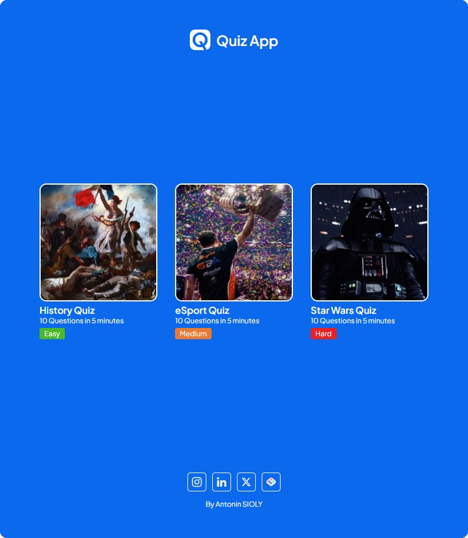
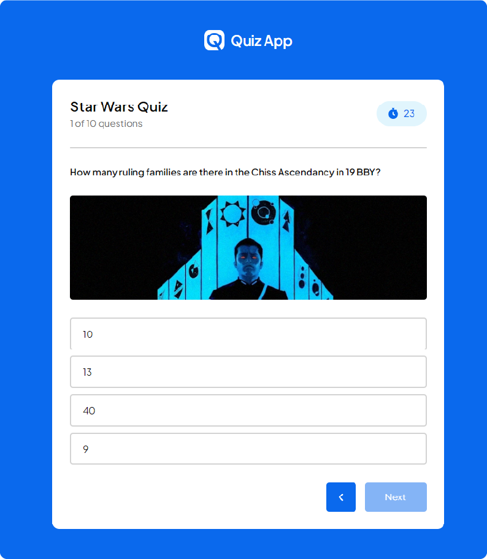

# Quiz App


## Overview
This project is a simple yet functional Quiz App built with HTML, CSS, and JavaScript. The app allows users to select a quiz, answer questions within a set time limit, and view their score at the end.

## Features
* **Quiz Selection:** Users can choose from multiple quizzes.

* **Timed Questions:** Each question has a 60-second timer.

* **Answer Feedback:** Correct and incorrect answers are highlighted after selection.

* **Score Tracking:** The final score is displayed at the end of the quiz with a summary of performance.

* **Responsive Design:** The app is fully responsive, providing a seamless experience across devices.

* **Back Navigation:** Users can return to the quiz selection page at any time.

## Demo
Check out the live demo: [Quiz App Live](https://heyanto.github.io/Quiz-App/)



## Installation
1. Clone the repository:
```bash
git clone https://github.com/HeyAnto/Quiz-App.git
```
2. Navigate to the project directory:
```bash
cd Quiz-App
```
3. Open "index.html" in your favorite web browser.

## Technologies Used
* **HTML5:** For structuring the app layout.

* **CSS3:** For styling and ensuring the app is responsive.

* **JavaScript (ES6):** For quiz logic, including timing, scoring, and user interaction management.

## Learning Objectives
This project was created as part of my journey to becoming a web developer. By building this Quiz App, I aimed to:

* Deepen my knowledge of HTML, CSS, and JavaScript.

* Practice DOM manipulation, event handling, and managing complex state in JavaScript.

* Implement responsive design for an optimal user experience across different devices.

I'm preparing to enter a formal web development training program in early 2025, and this project is a key step in my preparation.

## Contributing
If you would like to contribute to this project, please feel free to fork the repository and submit a pull request. Any feedback or suggestions are also welcome!